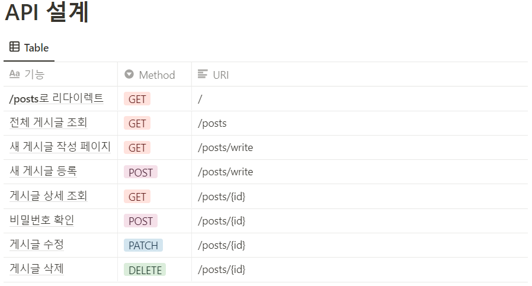
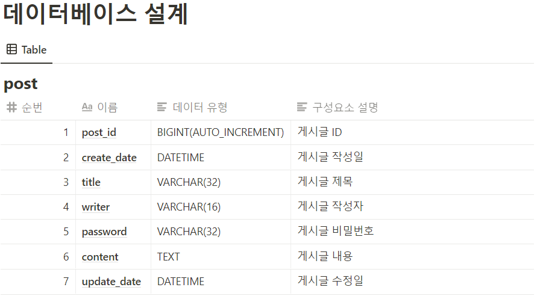

# 항해99_Chapter3_Spring과제
## 📌 과제 안내
- [Spring 입문 주차 개인 과제](https://www.notion.so/Spring-22bbdc97173c4f84b34fca1fe8cb0a92) 

## 📌 결과물 링크
- http://sparta-psy.shop/posts

## 📌 목표
```
💡 Goal:  "스프링 부트로 로그인 기능이 없는 나만의 항해 블로그 백엔드 서버 만들기"
```

## 📌 요구사항

- `1) 서비스 완성`,  `2) AWS 배포` 두 가지를 모두 완수해야 합니다.

### **1) 서비스 완성**
1. 전체 게시글 목록 조회 API
    - 제목, 작성자명, 작성 날짜를 조회하기
    - 작성 날짜 기준으로 내림차순 정렬하기
2. 게시글 작성 API
    - 제목, 작성자명, 비밀번호, 작성 내용을 입력하기
3. 게시글 조회 API
    - 제목, 작성자명, 작성 날짜, 작성 내용을 조회하기 
    (검색 기능이 아닙니다. 간단한 게시글 조회만 구현해주세요.)
4. 게시글 수정 API
    - API를 호출할 때 입력된 비밀번호를 비교하여 동일할 때만 글이 수정되게 하기
5. 게시글 삭제 API
    - API를 호출할 때 입력된 비밀번호를 비교하여 동일할 때만 글이 삭제되게 하기

### 2) AWS 배포
1. RDS 연결
    - MySQL을 이용하기
2. EC2 배포
    - Ubuntu EC2 를 구매한 뒤, 8080 포트와 80번 포트를 연결하여 포트 번호 없이도 서비스에 접속 가능하게 하기

## 📌 API 설계


## 📌 데이터베이스 설계
